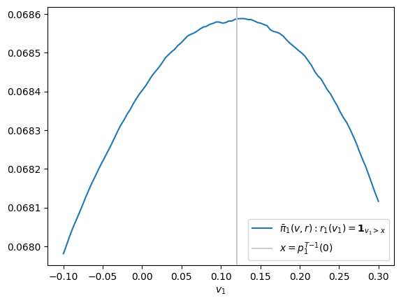
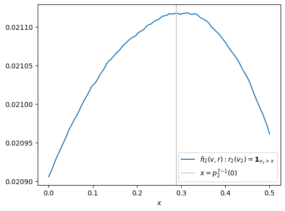

# Tarquin: Bayesian Information Acquisition under Sequential Sufficiency
It's said that a sibyl once offered a Roman king named Tarquinius nine books of prophecy at an exorbitant price. At the king's incredulous refusal, the sibyl burned three books and offered the remaining six at the same price. He again declined; she burned another three, and he, unnerved, procured the last three - the famed Sybilline Books - at her original price.

Since ancient times, new information has altered our valuations of complex assets in counterintuitive ways. Paid information sources are the Sibylline Books of today's information-rich world; few are worth their price, and some can be deceptive. To help navigate this problem, we offer a Bayesian framework specialized for optimizing information acquisition decisions under a sufficiency condition, supporting an evenhanded consideration of noisy, incomplete, or oddly presented information.

## The Tarquin Game
### Setup
Consider a game between two players, a *vendor* and a *buyer*. The vendor is equipped with a sequence (**future work: continuous game**) of *prophecies* $V=V_N,...,V_0 \in L^1(\mathbb{P})$, that is, random variables defined on a single probability space and integrable with finite expectation and two additional properties:
1. **(sufficiency)** $V$ is ordered so that each prophecy $V_n$ is sufficient for the next prophecy $V_{n-1}$ with respect to all already-acquired prophecies $V_N,...,V_n$; that is, $E(V_{n-1}|V_n)=E(V_{n-1}|V_N,...,V_n)$. This may appear strong, but in practice merely requires the buyer to compute and set $E(V_{n-1}|V_N,...,V_n) \rightarrow V_n$.
2. **(stochastic monotonicity)** $E(V_{n-1}|V_n=v_n)$ is weakly increasing. Similar to sufficiency, this is a practical constraint rather than a theoretical one (set $E(V_{n-1}|V_n) \rightarrow V_n$). This is stronger than $E(V_0|V_n=v_n)$ weakly increasing; the latter allows nonincreasing $E(V_{n-1}|V_n=v_n)$ if $\exists n': V_{n'} \perp V_0, 0 \lt n' \leq n-1$.

A sequence of prophecies $V=\{V_i\}_{i \isin \delta}$ is called a *book* with *index* $\delta$. A book with a singleton index is called *empty*. If for books $B_a,B_b$, $\delta_a \subset \delta_b$, $B_a$ is called an *abridgement* of $B_b$; a nonempty book with index $\delta$ has $2^{|\delta|-1}-1$ abridgements.

### Gameplay
At the outset the vendor, eager for business, provides the buyer with a large sample draw from $V$, allowing both to estimate the joint density $f(v_N,...,v_0)$ (which exists as all $V_n$ are measurable over $\mathbb{P}$).
After observing $f$ the vendor chooses a cost vector $c \in \mathbb{R}^N$ to price $V$ (for now we take $c$ as given and disregard optimal pricing) and the buyer chooses a policy vector $r=\{r_N,...,r_0\}: \mathbf{R}^N \mapsto \{0,1\}^N$, where $r_n(v_n)$ determines whether to purchase prophecy $v_{n-1}$ given the observed value of $v_n$. Finally, a single sample $v \in \mathbb{R}^N$ is drawn from $V$, and the buyer's payoff $\pi_N$ is determined by:

$$
\begin{equation}
  \pi_n(v,r) =
    \begin{cases}
      r_n(v_n)(\pi_{n-1}(v,r)-c_{n-1}) & n \geq 0 \\
      v_0-t & n<0
    \end{cases}
\end{equation}
$$

where $c_{-1}=0$ and tightness parameter $t$ represents the buyer's overhead (**future work: use budget constraint directly rather than $t$**). That is, at each step $n$, if the buyer decides to proceed ($r_n(v_n)=1$) they incur cost $c_{n-1}$ and receive the outcome of step $n-1$; otherwise, they exit the game and pay any cost already incurred. If the buyer arrives at step $n=0$ they receive the value $v_0$ of the final prophecy, less overhead $t$.

### Tarquinian Policy
A policy $r^T$ is *Tarquinian* if it satisfies

$$
\begin{equation}
r^T_n=\text{arg max}_{r_n} E(\pi_n|V,r) \forall n\in\{0,...,N\}
\end{equation}
$$

**Proposition 1 (end-state Tarquinian policy).** For any $V,c,t$, we have $r_0^T(v_0)=\mathbf{1}_{v_0>t}$.

**Proof.**

$$
\begin{aligned}
E(\pi_0|V,r)&=E(r_0(v_0)(v_0-t)-c_{-1}|V_0=v_0) \\
&= r_0(v_0)(v_0-t) \\
&= \begin{cases}
v_0-t & r_0(v_0)=1 \\
0 & r_0(v_0)=0
\end{cases}
\end{aligned}
$$

If $v_0>t$, $v_0-t>0$, so $r_0(v_0)=1$ maximizes $E(\pi_0|V,r)$, and the reverse shows $r_0(v_0)=0$ maximizes $E(\pi_0|V,r)$ when $v_0<t$. □

That is, once all costs are sunk and the true value $v_0$ is revealed, the Tarquinian buyer acquires $v_0$ (at cost $c_{-1}=0$) iff its value after overhead $t$ is positive. 

For convenience, define the expected value of "proceeding" to $n-1$, that is, of acquiring $v_{n-1}$ after costs:

$$
\begin{equation}
p_n(v_n,r) \coloneqq E(\pi_{n-1}|V_n=v_n,r) - c_{n-1}, 0 \leq n \leq N
\end{equation}
$$

**Proposition 2 (Tarquinian policy is proceeding on positive value).** For $n=0,...,N$, we have $r_n^T=\mathbf{1}_{p_n^T(v_n)>0}$.

**Proof.** First, write Tarquinian policy at step $n$ as:

$$
\begin{equation}
\begin{aligned}
r_n^T &= \text{arg max}_{r_n} E(\pi_n|V,r) \\
&= \text{arg max}_{r_n} E(r_n(v_n)(\pi_{n-1}(V,r)-c_{n-1})|V,r) \\
&= \text{arg max}_{r_n} r_n(v_n) E(\pi_{n-1}(V,r)-c_{n-1}|V,r) \\
&= \text{arg max}_{r_n} r_n(v_n) (E(\pi_{n-1}(V,r)|V,r)-c_{n-1}) \\
&= \text{arg max}_{r_n} r_n(v_n) p_n(v_n)
\end{aligned}
\end{equation}
$$

Which is satisfied by $r_n^T=\mathbf{1}_{p_n^T(v_n)>0}$ by the same argument as was applied in (1) to $r_0^T$.

**Proposition 3 (value of proceeding increasing in value signal).** $p_n^T$ is weakly increasing in $v_n$ for all $n$.

**Proof.** (induction) This is evident for $n=0$; assume $p_{n-1}^T$ is weakly increasing in $v_{n-1}$.

<!-- By definition $p_{n-1}^T(v_{n-1}) \geq 0 \forall v_{n-1} \in S_{n-1}$.  -->
Since $p_{n-1}^T$ is increasing by hypothesis,

$$
\exists x \in \mathbb{R}: \{p_{n-1}^T(v_{n-1})>0\}=[x,\infty)
$$

Thus $\mathbf{1}_{p_{n-1}^T(v_{n-1})>0}(V_{n-1})$ is also increasing, and so is the product

$$
g(V_{n-1})=p_{n-1}^T(V_{n-1})\mathbf{1}_{p_{n-1}^T(v_{n-1})>0}(V_{n-1})
$$

In general, for $g$ increasing, $Y$ stochastically increasing in $X$, $E(g(Y)|X=x)$ is increasing. Therefore

$$
p_n^T(v_n)=E(p_{n-1}^T(V_{n-1})\mathbf{1}_{p_{n-1}^T(v_{n-1})>0}(V_{n-1})|V_n=v_n)
$$

is non-decreasing. □

**Proposition 4 (value of proceeding, integral form).** If $f_{n-1|n}$ is the density of $V_{n-1}|V_n$ then

$$
\begin{equation}
p_n(v_n,r) = \int_{\mathbb{R}} r_{n-1}(v_{n-1})p_{n-1}(v_{n-1})f_{n-1|n}(v_{n-1}|v_n)dv_{n-1}-c_{n-1}, n \gt 0
\end{equation}
$$

**Proof.** First, write $p_n$ in terms of $p_{n-1}$:

$$
\begin{aligned}
p_n(v_n,r) &= E(\pi_{n-1}|V_n,r)-c_{n-1} \\
&= E(r_{n-1}(V_{n-1})(\pi_{n-1}(V_{n-1},...,V_0)-c_{n-2})|V_n)-c_{n-1} \\
&= E(E(r_{n-1}(V_{n-1})(\pi_{n-1}(V_{n-1},...,V_0)-c_{n-2})|V_n,V_{n-1})|V_n)-c_{n-1} \\
&= E(E(r_{n-1}(V_{n-1})(\pi_{n-1}(V_{n-1},...,V_0)-c_{n-2})|V_{n-1})|V_n)-c_{n-1} \textrm{ (sufficiency)} \\
&= E(r_{n-1}(V_{n-1})E(\pi_{n-1}(V_{n-1},...,V_0)-c_{n-2}|V_{n-1})|V_n)-c_{n-1} \\
&= E(r_{n-1}(V_{n-1})p_{n-1}(V_{n-1})|V_n)-c_{n-1}
\end{aligned}
$$

By the conditional form of the "law of the unconcious statistician", for measurable $h$ we have

$$
E(h(x)|Y=y) = \int h(x)f_{X|Y}(x|y)dx
$$

Thus ( $h(v_{n-1}) \coloneqq r_{n-1}(v_{n-1})p_{n-1}(v_{n-1})$ ),

$$
p_n = \int_{\mathbb{R}} r_{n-1}(v_{n-1})p_{n-1}(v_{n-1})f_{n-1|n}(v_{n-1}|v_n)dv_{n-1}-c_{n-1}
$$

□

Now we can write the expected value of acquiring $V_{n-1}$ under Tarquinian policy as

$$
\begin{equation}
p_n^T(v_n) = \begin{cases}
\int_{S_{n-1} \coloneqq \{v_{n-1}: p_{n-1}^T(v_{n-1})>0\}} p_{n-1}^T(v_{n-1})f_{n-1|n}(v_{n-1}|v_n)dv_{n-1} - c_{n-1} & n \gt 0 \\
v_0-t & n = 0
\end{cases}
\end{equation}
$$

For instance, $p_1^T(v_1)=\int_t^\infty(v_0-t)f_{0|1}(v_0|v_1)dv_0-c_0$.

**Remark (independence).** If for some $n$ $V_{n+1} \perp V_n$, stochastic monotonicity gives $V_{n'} \perp V_n, f_{n|{n'}}(v_n|v_{n'})=f_n(v_n) \forall n' \gt n$. $p_{n+1}^T(v_{n+1})$ is constant

$$
p_{n+1}^T(v_{n+1}) = p_{n+1}^T = \int_{S_n} p_n^T(v_n)f_n(v_n)-c_n
$$

So

$$
S_{n+1}=\begin{cases}
\mathbb{R} & p_{n+1}^T \geq 0 \\
\emptyset & p_{n+1}^T \lt 0
\end{cases}
$$

And

$$
\begin{equation}
p_{n+2}^T = \begin{cases}
p_{n+1}^T-c_{n+1} & p_{n+1}^T \geq 0 \\
-c_{n+1} & p_{n+1}^T \lt 0
\end{cases}
\end{equation}
$$

That is, proceeding from $n+2$ to $n+1$ with certainty yields the same payoff as proceeding from $n+1$ to $n$, less the cost of $n+1$. In fact, for $m \gt 1$:

$$
p_{n+m}^T(v_{n+m}) = \begin{cases}
p_{n+1}^T-\sum_{i=n+2}^{n+m-1} c_i & p_{n+1}^T \geq \sum_{i=n+2}^{n+m-2} c_i \\
-c_{n+m-1} & p_{n+1}^T \lt \sum_{i=n+2}^{n+m-2} c_i 
\end{cases}
$$

**Remark (crystal ball prophecy).** If for some $n \gt 0$ $V_n=V_{n-1}=...=V_0$ we have

$$
\begin{equation}
p_n^T(v_n) = \begin{cases}
v_n-t-\sum_{i=0}^{n-1}c_i & v_n \geq t+\sum_{i=0}^{n-1}c_i \\
-c_{n-1} & v_n \lt t+\sum_{i=0}^{n-1}c_i
\end{cases}
\end{equation}
$$

That is, proceeding from $n$ to $n-1$ yields the known value of $v_0$, less all downstream and overhead costs.

**todo: generalize to complete information i.e. $v_0=g_n(v_n)$**

**Proposition 5 (set of signals endorsed by Tarquinian policy unbounded above).** *If the real set ${S_n \coloneqq \{v_n: p_n^T(v_n)>0\}}$ is non-empty, it is a right-unbounded interval.*

**Proof.** 
Suppose $a \in S_n$ and take arbitrary $c \gt a$. Note that since $p_n^T$ is nondecreasing, $c \in S_n$. But for arbitrary $b \in (a,c)$, we have $b \gt a \implies b \in S_n$ for the same reason; thus, $S_n$ is an interval. By the same reasoning, $a \in S_n \implies 2a \in S_n$, thus $S_n$ is right-unbounded. □

**Proposition 6 (set of signals endorsed by Tarquinian policy under strict monotonicity with zero).** If $p_n^T$ is strictly increasing and has a zero then $S_n=[{p_n^T}^{-1}(0), \infty)$.

**Proof.** Assume conditions. Since $p_n^T$ is strictly increasing hence bijective, $v^* \coloneqq {p_n^T}^{-1}(0)$ exists and is unique. Since ${p_n^T}(v^\*)=0 \geq 0$, $v^\* \in S_n$, and from strict monontonicity for $v' \lt v$, we have $p_n^T(v') \lt 0 \implies v' \notin S_n$, so $v^* = \inf S = \min S$. Since $v^* \in S_n$, $S_n$ is nonempty and (by (4)) right-unbounded, hence $S_n=[{p_n^T}^{-1}(0), \infty)$. □

**todo: can we generalize this to broader p (nondecreasing with a unique zero)**

**Remark (constrained VOI).** Given the ordering of $V$, a policy $r$, and fixing costs $c_{n-2},...,c_0$, the *value of information* $V_{n-1}$ is the expected payoff of the state in which the buyer has purchased that prophecy:

$$
\begin{equation}
E(\pi_{n-1}|V_n=v_n) = \int_{\mathbb{R}} r_{n-1}(v_{n-1})p_{n-1}(v_{n-1})f_{n-1|n}(v_{n-1}|v_n)dv_{n-1}, n \gt 0
\end{equation}
$$

However, in general the VOI is simply the difference between the values of the purchased state and the next best alternative. For fixed $V$, the sole alternative is to exit, but if the buyer is allowed to skip $V_{n-1}$, there could be a better alternative, lowering the value of this prophecy. We will discuss this in more detail in a future section.

**Remark (Gaussian case).** If $V \sim \mathcal{N}(\mu, \Sigma)$ then **(need to explain $v^*$)**:

$$
\begin{aligned}
p_n^T(v_n) &= \frac{1}{\sigma_{n-1|n}}\int_{v_{n-1}^*}^\infty p_{n-1}^T(v_{n-1})\phi\left(\frac{v_{n-1}-\mu_{n-1|n}(v_n)}{\sigma_{n-1|n}}\right) dv_{n-1} - c_{n-1} \\
&= \int_{\frac{v_{n-1}^*-\mu_{n-1|n}(v_n)}{\sigma_{n-1|n}}}^\infty p_{n-1}^T(\mu_{n-1|n}(v_n)+z\sigma_{n-1|n})\phi(z)dz - c_{n-1} \\
\end{aligned}
$$

**Example.** $V = \begin{pmatrix}V_2\\V_1\\V_0\end{pmatrix} \sim \mathcal{N} \left(\begin{pmatrix}1\\0.5\\-0.2\end{pmatrix},\begin{pmatrix}
1 & 0.3 & 0.15\\[4pt]
0.3 & 1 & 0.5\\[4pt]
0.15 & 0.5 & 2
\end{pmatrix}\right), c=\begin{pmatrix}0\\0.05\\0.1\end{pmatrix}, t=1$

Note that $
\Sigma^{-1}=
\begin{pmatrix}
\frac{100}{91} & -\frac{30}{91} & 0\\[6pt]
-\frac{30}{91} & \frac{113}{91} & -\tfrac{2}{7}\\[6pt]
0 & -\tfrac{2}{7} & \tfrac{4}{7}
\end{pmatrix}$, so $V_2\perp V_0\mid V_1$. We have (confirm increasing)

$$
\begin{aligned}
p_1^T(v_1) &= \int_{\frac{t-\mu_{0|1}(v_1)}{\sigma_{0|1}}}^\infty (\mu_{0|1}(v_1)-t+z\sigma_{0|1})\phi(z)dz-c_0 \\
&= (\mu_{0|1}(v_1)-t)\int_{\frac{t-\mu_{0|1}(v_1)}{\sigma_{0|1}}}^\infty \phi(z) dz + \sigma_{0|1} \int_{\frac{t-\mu_{0|1}(v_1)}{\sigma_{0|1}}}^\infty z\phi(z) dz - c_0 \\
&= (\mu_{0|1}(v_1)-t) \Phi\left(\frac{\mu_{0|1}(v_1)-t}{\sigma_{0|1}}\right) + \sigma_{0|1} \phi\left(\frac{\mu_{0|1}(v_1)-t}{\sigma_{0|1}}\right) - c_0 \\
&= (0.5v_1-1.45)\Phi\left(\frac{0.5v_1-1.45}{\sqrt{1.75}}\right) + \sqrt{1.75} \phi\left(\frac{0.5v_1-1.45}{\sqrt{1.75}}\right) - 0.1 \\
\end{aligned}
$$

and ${p_1^T}^{-1}(0) \approx 0.1204$, which threshold we can empirically confirm maximizes $E(\pi_1|v_1, r)$:
```
import numpy as np
from matplotlib import pyplot as plt

sample_size = 50_000_000
rng = np.random.default_rng(seed=0)
samples = rng.multivariate_normal(np.array([1, 0.5, -0.2]), np.array([
    [1, 0.3, 0.15],
    [0.3, 1, 0.5],
    [0.15, 0.5, 2]
]), size=sample_size)
c0, t = 0.1, 1

pi_0 = np.maximum(samples[:,2] - t, 0)
x_grid = np.linspace(2.58, 3.05, 100)
mean_payoff = ((samples[:,1][None, :] > x_grid[:, None]) * (pi_0 - c0)[None, :]).mean(axis=1)

plt.plot(x_grid, mean_payoff, label=r'$\bar{\pi}_1(v,r): r_1(v_1)=\mathbf{1}_{v_1>x}$')
plt.axvline(0.12038876891520353, color = '0.8', label = r'$x={p_1^T}^{-1}(0)$')
plt.xlabel(r'$v_1$')
plt.legend()
```


We do not analytically derive $p_2^T(v_2) = \int_{\frac{v_1^*-\mu_{1|2}(v_2)}{\sigma_{1|2}}}^\infty p_1^T(\mu_{1|2}(v_2)-z\sigma_{1|2})\phi(z)dz - c_1$, but we can numerically find and validate its root ($\approx 0.2886$):
```
import numpy as np 
from matplotlib import pyplot as plt

sample_size = 200_000_000
rng = np.random.default_rng(seed=0)

samples = rng.multivariate_normal(
    mean=np.array([1, 0.5, -0.2]), 
    cov=np.array([
        [1,   0.3,  0.15],
        [0.3, 1,    0.5 ],
        [0.15,0.5,  2   ]
    ]), 
    size=sample_size
)

v2, v1, v0 = samples[:,0], samples[:,1], samples[:,2]
c0, c1, t = 0.1, 0.05, 1.0
pi_0 = np.maximum(v0 - t, 0)

x1_star = 0.12038876891520353
pi_1 = np.where(v1 > x1_star, pi_0 - c0, 0.0)

x2_grid = np.linspace(0, 0.5, 100)
mean_payoff_2 = np.array([
    np.where(v2 > x2, pi_1 - c1, 0.0).mean()
    for x2 in x2_grid
])

plt.plot(x2_grid, mean_payoff_2, label=r'$\bar{\pi}_2(v,r): r_2(v_2)=\mathbf{1}_{v_2>x}$')
plt.axvline(0.28861159173402184, color='0.8', label=r'$x={p_2^T}^{-1}(0)$')
plt.xlabel(r'$x$')
plt.legend()
plt.show()
```


## The Tarquin Algorithm

### Algorithm 1 (training)

**Inputs:** Joint distribution $f(v_N,...,v_0)$, cost vector $c_N,...,c_0$, tightness parameter $t$.

**Output:** Tarquinian values $v^*\in\mathbb{R}^N$.

1. For $n=1,...,N$:

    a. Calculate the joint density of $V_{n-1},V_n$, $f_{n-1,n}(v_{n-1},v_n)=\int_\mathbb{R^{N-2}} f(v) \prod_{\substack{i=1 \ i \ne n-1,n}}^Ndv_i$

    b. Calculate the marginal of $V_n$, $f_n(v_n)=\int_\mathbb{R^{N-1}} f(v) \prod_{\substack{i=1 \ i \ne n}}^Ndv_i$

    c. Calculate the conditional density of $V_{n-1}|V_n$, $f_{n-1|n}(v_{n-1}|v_n)=\frac{f_{n-1,n}(v_{n-1},v_n)}{f_n(v_n)}$

2. Calculate $p_0^T(v_0) = v_0-t$
3. For $n=1,...,N$:

    a. Determine $v_{n-1}^*$ such that $v_{n-1}^*=\inf \{v_{n-1}: p_{n-1}^T(v_{n-1})=0\}$ (possibly using a root-finding algorithm)

    b. Calculate $p_n^T(v_n)=\int_{v_{n-1}^*}^\infty p_{n-1}^T(v_{n-1})f_{n-1|n}(v_{n-1}|v_n)dv_{n-1}-c_{n-1}$

4. Calculate $v_N^*$ as specified in 3a.
5. Return $v^* \coloneqq v_N^*,...,v_0^*$

### Algorithm 2 (inference)

**Inputs:** Value-of-proceeding function $p^T$, value draw $v\in \mathbb{R}^N$.

**Outputs:** Boolean decision vector $r\in \{0,1\}^N$.

1. For $n=N,...,1$:

    a. If $v_n \geq v_n^*$, set $r_n=1$.

    b. Otherwise, set $r_i=0 \forall i \leq n$ and break.

2. Return $r \coloneqq r_N,...,r_0$

### Implementation
Here we use a Gaussian mixture model (GMM) to implement the Tarquin Algorithm, as it provides a simple approach that still yields analytical conditional densities. We leave the number of components `k` as a hyperparameter. We use adaptive quadrature for integral evaluation...


**(abridgements -> skip steps, trilogies -> rearrangements)**
