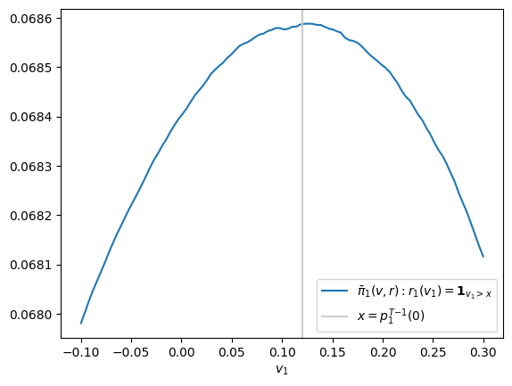
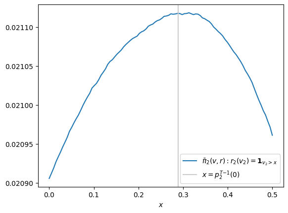
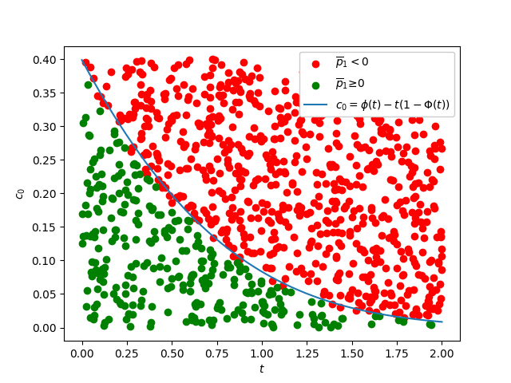

# Tarquin: Optimal Information Acquisition under Sequential Sufficiency
It's said that a sibyl once offered a Roman king named Tarquinius nine books of prophecy at an exorbitant price. At the king's incredulous refusal, the sibyl burned three books and offered the remaining six at the same price. He again declined; she burned another three, and he, unnerved, procured the last three - the famed Sibylline Books - at her original price.

Since ancient times, new information has altered our valuations of complex assets in counterintuitive ways. Paid information sources are the Sibylline Books of today's information-rich world; few are worth their price, and some can be deceptive. To help navigate this problem, we offer a measure-theoretic framework for optimizing information acquisition decisions under a sufficiency condition, supporting an evenhanded consideration of noisy, incomplete, or oddly presented information.

## Installation

```bash
pip install git+https://github.com/tfisher010/tarquin
```

Runtime dependencies (`numpy`, `scikit-learn`) install automatically; Python >= 3.9. The plotting snippets in this README additionally need `matplotlib`. To develop or run the tests, clone the repo and:

```bash
pip install -e ".[dev]"
pytest
```

## Quickstart

```python
import numpy as np
import tarquin as tq

# Data: columns in README order (V_N, ..., V_0), payoff prophecy V_0 last. Here N = 2.
data = tq.make_demo_data()                       # or your own (n_samples, N+1) array

# Fit the N adjacent-pair conditionals the recursion needs (sufficiency).
# Pass a range to BIC-select the component count per pair (a fixed, too-large count
# over-parameterizes the fit and injects spurious wiggle into the value functions).
pairs = tq.fit_pairwise_gmms(data, n_components=range(1, 6))

# Train: thresholds v* = (v_N*, ..., v_0*) for cost vector c = (c_{N-1}, ..., c_0)
# and overhead t. These costs land both upstream thresholds at interior values on this data.
v_star, _ = tq.train_tarquin(pairs, c=np.array([35.0, 30.0]), t=float(np.percentile(data[:, -1], 40)))

# Infer: which prophecies should the buyer purchase for a new draw v = (v_N, ..., v_0)?
r = tq.infer_tarquin(v_star, data[0])

# Evaluate honestly: fit on train, score the policy on a holdout (not the fitting sample).
# Note: evaluate_policy_mc needs *uncensored* draws (every column revealed), since the learned
# policy proceeds below the incumbent threshold, into the region a truncated deployment sample
# never observed. It is an in-distribution / synthetic check, not a substitute for an uncensored
# experiment; see "Deployed and truncated samples".
train, test = tq.holdout_split(data, test_frac=0.3)
t = float(np.percentile(data[:, -1], 40))
v_star, _ = tq.train_tarquin(tq.fit_pairwise_gmms(train), c=np.array([35.0, 30.0]), t=t)
pi = tq.evaluate_policy_mc(test, (0, 1, 2), v_star, np.array([np.nan, 35.0, 30.0]), t=t)

# Quantify threshold uncertainty (bootstrap CIs over refit replicates).
boot = tq.bootstrap_thresholds(data, c=np.array([35.0, 30.0]), t=t, n_boot=200)
```

The `__main__` block in `tarquin.py` is a fuller example: the worked Gaussian case below, Monte-Carlo policy evaluation, and abridgement ranking. A function-level API reference is in the [API](#api) section.

## The Tarquin Game
### Setup
Consider a game between two players, a *vendor* and a *buyer*. The vendor is equipped with a sequence of *prophecies* $V=V_N,...,V_0 \in L^1(\mathbb{P})$, that is, random variables defined on a single probability space and integrable with finite expectation and two additional properties:
1. **(sufficiency)** $V$ is ordered so that the conditional distribution of $V_{n-1}$ given $V_N,...,V_n$ depends only on $V_n$; equivalently, $V_N \to V_{N-1} \to \cdots \to V_0$ is a Markov chain. This may appear strong, but it can often be arranged: if the buyer constructs each $V_n$ as a sufficient posterior summary of $V_{n-1}$ given $V_N,...,V_n$, the chain holds by construction. Two caveats keep this honest. That construction is itself a modeling step (it presupposes enough of the joint to form the summaries), so it is not free, and on raw, unprocessed signals the Markov property should not be assumed. And it secures only sufficiency, not the stochastic monotonicity of Assumption 2, which must still be verified. The `diagnose_sufficiency` / `diagnose_fosd` helpers are provided to test both assumptions on data.
2. **(stochastic monotonicity)** $V_{n-1}\mid V_n=v_n$ is first-order stochastically increasing in $v_n$: $P(V_{n-1}>a\mid V_n=v_n)$ is weakly increasing in $v_n$ for every $a$. Equivalently, $E(g(V_{n-1})\mid V_n=v_n)$ is weakly increasing in $v_n$ for every weakly increasing $g$. This is strictly stronger than mean-monotonicity of $E(V_{n-1}\mid V_n=v_n)$, and the strength is needed to inductively propagate monotonicity of $p_n^T$ (Prop. 3 below). The Gaussian example used throughout satisfies it automatically; in general it is a property the buyer should verify when constructing $V$.

A sequence of prophecies $V=\{V_i\}_{i \in \delta}$ is called a *book* with *index* $\delta$. A book with a singleton index is called *empty*. If for books $B_a,B_b$ we have $\delta_a \subsetneq \delta_b$, $V_0 \in \delta_a$, and $B_a$ is nonempty (i.e. $|\delta_a| \geq 2$), then $B_a$ is called an *abridgement* of $B_b$; a book with index $\delta$, $|\delta| \geq 2$, has $2^{|\delta|-1}-2$ abridgements. (The excluded singleton $\{V_0\}$ would correspond to seeing the payoff prophecy for free; this is an unphysical upper bound rather than a feasible policy in the original game.)

Note that staying at the level of conditional expectations and Markov sufficiency, rather than adopting Bayesian machinery, keeps the framework agnostic about how the joint distribution over $V$ is produced (empirical, generative, or posterior-derived) and avoids committing to priors or likelihood factorizations the practitioner may not have. The structural assumption on $V$ remains cleanly separated from the decision rule, and the same algorithm covers settings ranging from population filtering against historical data to fully Bayesian belief updating.

### Gameplay
At the outset the vendor, eager for business, provides the buyer with a large sample draw from $V$, allowing both to estimate the joint density $f(v_N,...,v_0)$ (which we assume to exist, i.e. $V$ has an absolutely continuous joint law; mere measurability would not suffice).
After observing $f$ the vendor chooses a nonnegative cost vector $c \in \mathbb{R}^N$ to price $V$ (for now we take $c$ as given and disregard optimal pricing) and the buyer chooses a policy $r=(r_N,...,r_0)$, where each $r_n: \mathbb{R} \to \{0, 1\}$ and $r_n(v_n)$ determines whether to purchase prophecy $v_{n-1}$ given the observed value of $v_n$. Finally, a single sample $v \in \mathbb{R}^{N+1}$ is drawn from $V$, and the buyer's payoff $\pi_N$ is determined by:

$$
\begin{equation}
  \pi_n(v,r) =
    \begin{cases}
      r_n(v_n)(\pi_{n-1}(v,r)-c_{n-1}) & n \geq 0 \\
      v_0-t & n<0
    \end{cases}
\end{equation}
$$

where $c_{-1}=0$ and tightness parameter $t$ represents the buyer's overhead. That is, at each step $n$, if the buyer decides to proceed ($r_n(v_n)=1$) they incur cost $c_{n-1}$ and receive the outcome of step $n-1$; otherwise, they exit the game and pay any cost already incurred. If the buyer arrives at step $n=0$ they receive the value $v_0$ of the final prophecy, less overhead $t$.

### Tarquinian Policy
A policy $r^T$ is *Tarquinian* if it satisfies

$$
\begin{equation}
r^T_n=\text{arg max}_{r_n} E(\pi_n|V_n=v_n,r) \quad \forall n\in\{0,...,N\}
\end{equation}
$$

The expectation conditions on $V_n=v_n$. The buyer has in fact observed the whole acquired prefix $V_N,...,V_n$ by this point, so restricting $r_n$ to a function of $v_n$ alone is a genuine restriction; it is *without loss of optimality* precisely because of sufficiency (Assumption 1): the Markov property gives $(V_{n-1},...,V_0)\perp(V_N,...,V_{n+1})\mid V_n$, so the discarded prefix carries no information about the downstream payoff and the optimal decision depends on the history only through $v_n$. (Conditioning instead on the full draw $V$, including the not-yet-acquired $V_{n-1},...,V_0$, would make $\pi_n$ deterministic and the decision clairvoyant; that is the separate thing being excluded here.) This is the role sufficiency plays in justifying the *decision rule*, distinct from its role in collapsing the recursion to adjacent pairs (Prop. 4). Since each $\pi_n$ depends on the downstream decisions $r_{n-1},...,r_0$, the Tarquinian condition above is a system whose nodewise optima are resolved together by the backward recursion below.

**Nodewise optima are globally optimal.** The Tarquinian condition is defined nodewise (eq. 2), but the resulting policy also maximizes the global objective $E(\pi_N)$, with no circularity in the recursion. By Prop. 4, $p_n^T(v_n)$ depends only on the downstream decisions $r_{n-1},...,r_0$, never on $r_n$ itself or on any upstream choice. So the recursion fixes $r_0^T$ first, which determines $p_1^T$ and hence $r_1^T$, and so on, and no later choice perturbs an earlier value function. Because each $r_n$ enters the realized payoff $\pi_N$ only through the single factor $r_n(v_n)$ it multiplies, choosing each $r_n$ to maximize $p_n^T(v_n)$ jointly maximizes $E(\pi_N)$. This is exactly the principle-of-optimality / backward-induction argument for the optimal-stopping problem named in the Snell-envelope remark below.

**Proposition 1 (end-state Tarquinian policy).** For any $V,c,t$, we have $r_0^T(v_0)=\mathbf{1}_{v_0>t}$.

**Proof.**

$$
\begin{aligned}
E(\pi_0|V,r)&=E(r_0(v_0)(v_0-t)-c_{-1}|V_0=v_0) \\
&= r_0(v_0)(v_0-t) \\
&= \begin{cases}
v_0-t & r_0(v_0)=1 \\
0 & r_0(v_0)=0
\end{cases}
\end{aligned}
$$

If $v_0>t$, $v_0-t>0$, so $r_0(v_0)=1$ maximizes $E(\pi_0|V,r)$, and the reverse shows $r_0(v_0)=0$ maximizes $E(\pi_0|V,r)$ when $v_0<t$. □

That is, once all costs are sunk and the true value $v_0$ is revealed, the Tarquinian buyer acquires $v_0$ (at cost $c_{-1}=0$) iff its value after overhead $t$ is positive. 

For convenience, define the expected value of "proceeding" to $n-1$, that is, of acquiring $v_{n-1}$ after costs:

$$
\begin{equation}
p_n(v_n,r) \coloneqq E(\pi_{n-1}|V_n=v_n,r) - c_{n-1}, 0 \leq n \leq N
\end{equation}
$$

**Proposition 2 (Tarquinian policy is proceeding on positive value).** For $n=0,...,N$, we have $r_n^T=\mathbf{1}_{p_n^T(v_n)>0}$.

**Proof.** First, write Tarquinian policy at step $n$ as:

$$
\begin{equation}
\begin{aligned}
r_n^T &= \text{arg max}_{r_n} E(\pi_n|V_n=v_n,r) \\
&= \text{arg max}_{r_n} E(r_n(v_n)(\pi_{n-1}(V,r)-c_{n-1})|V_n=v_n,r) \\
&= \text{arg max}_{r_n} r_n(v_n) E(\pi_{n-1}(V,r)-c_{n-1}|V_n=v_n,r) \\
&= \text{arg max}_{r_n} r_n(v_n) (E(\pi_{n-1}(V,r)|V_n=v_n,r)-c_{n-1}) \\
&= \text{arg max}_{r_n} r_n(v_n) p_n(v_n)
\end{aligned}
\end{equation}
$$

Which is satisfied by $r_n^T=\mathbf{1}_{p_n^T(v_n)>0}$ by the same argument applied to $r_0^T$ in Proposition 1.

**Proposition 3 (value of proceeding increasing in value signal).** $p_n^T$ is weakly increasing in $v_n$ for all $n$.

**Proof.** (induction) This is evident for $n=0$; assume $p_{n-1}^T$ is weakly increasing in $v_{n-1}$. Define

$$
g(v_{n-1}) \coloneqq p_{n-1}^T(v_{n-1}) \cdot \mathbf{1}_{p_{n-1}^T(v_{n-1})>0}.
$$

If $\{p_{n-1}^T>0\}$ is empty, $g \equiv 0$, trivially nondecreasing. Otherwise, weak monotonicity of $p_{n-1}^T$ gives that $\{p_{n-1}^T>0\}=(x,\infty)$ or $[x,\infty)$ for some $x \in \mathbb{R}$, so the indicator $\mathbf{1}_ {p_{n-1}^T>0}$ is weakly increasing in $v_{n-1}$, and so is the product $g$.

By stochastic monotonicity (FOSD), $E(g(V_{n-1})\mid V_n=v_n)$ is weakly increasing in $v_n$ for every weakly increasing $g$. Therefore

$$
p_n^T(v_n)=E\left(g(V_{n-1})\bigm| V_n=v_n\right)-c_{n-1}
$$

is non-decreasing. □

**Corollary (endorsement set is a right-unbounded interval).** Since $p_n^T$ is weakly increasing (Prop. 3), the endorsement set $S_n \coloneqq \{v_n: p_n^T(v_n)>0\}$ is either empty or a right-unbounded interval. Writing $v_n^\ast \coloneqq \inf S_n$, the recursion below integrates over $S_{n-1}=(v_{n-1}^\ast,\infty)$ and inference reduces to a single threshold per step.

**Proposition 4 (value of proceeding, integral form).** If $f_{n-1|n}$ is the density of $V_{n-1}|V_n$ then

$$
\begin{equation}
p_n(v_n,r) = \int_{\mathbb{R}} r_{n-1}(v_{n-1})p_{n-1}(v_{n-1})f_{n-1|n}(v_{n-1}|v_n)dv_{n-1}-c_{n-1}, n \gt 0
\end{equation}
$$

**Proof.** First, write $p_n$ in terms of $p_{n-1}$:

$$
\begin{aligned}
p_n(v_n,r) &= E(\pi_{n-1}|V_n,r)-c_{n-1} \\
&= E(r_{n-1}(V_{n-1})(\pi_{n-2}(V_{n-2},...,V_0)-c_{n-2})|V_n)-c_{n-1} \\
&= E(E(r_{n-1}(V_{n-1})(\pi_{n-2}(V_{n-2},...,V_0)-c_{n-2})|V_n,V_{n-1})|V_n)-c_{n-1} \\
&= E(E(r_{n-1}(V_{n-1})(\pi_{n-2}(V_{n-2},...,V_0)-c_{n-2})|V_{n-1})|V_n)-c_{n-1} \textrm{ (sufficiency)} \\
&= E(r_{n-1}(V_{n-1})E(\pi_{n-2}(V_{n-2},...,V_0)-c_{n-2}|V_{n-1})|V_n)-c_{n-1} \\
&= E(r_{n-1}(V_{n-1})p_{n-1}(V_{n-1})|V_n)-c_{n-1}
\end{aligned}
$$

By the conditional form of the "law of the unconscious statistician", for measurable $h$ we have

$$
E(h(x)|Y=y) = \int h(x)f_{X|Y}(x|y)dx
$$

Thus ( $h(v_{n-1}) \coloneqq r_{n-1}(v_{n-1})p_{n-1}(v_{n-1})$ ),

$$
p_n = \int_{\mathbb{R}} r_{n-1}(v_{n-1})p_{n-1}(v_{n-1})f_{n-1|n}(v_{n-1}|v_n)dv_{n-1}-c_{n-1}
$$

□

Now we can write the expected value of acquiring $V_{n-1}$ under Tarquinian policy as

$$
\begin{equation}
p_n^T(v_n) = \begin{cases}
\int_{S_{n-1} \coloneqq \{v_{n-1}: p_{n-1}^T(v_{n-1})>0\}} p_{n-1}^T(v_{n-1})f_{n-1|n}(v_{n-1}|v_n)dv_{n-1} - c_{n-1} & n \gt 0 \\
v_0-t & n = 0
\end{cases}
\end{equation}
$$

For instance, $p_1^T(v_1)=\int_t^\infty(v_0-t)f_{0|1}(v_0|v_1)dv_0-c_0$.

**Remark (Snell envelope).** Since $S_{n-1}=\{p_{n-1}^T>0\}$, the integral above is the conditional expectation of the *positive part* of the next value:

$$
p_n^T(v_n) = E\big[(p_{n-1}^T(V_{n-1}))^+ \mid V_n=v_n\big] - c_{n-1}, \quad n>0,
$$

with $p_0^T(v_0)=v_0-t$. This is the backward induction of an optimal-stopping problem: $p_n^T$ is a Snell envelope, and "proceed iff $p_n^T>0$" (Prop. 2) is its optimal stopping rule. The first level is a call option on $V_0$ struck at $t$,

$$
p_1^T(v_1) = E\big[(V_0-t)^+ \mid V_1=v_1\big] - c_0,
$$

which under the Gaussian conditional below is exactly the **Bachelier (normal) call price** (the $(\mu-t)\Phi+\sigma\phi$ form derived in the Example). Naming the structure lets the method borrow the standard optimal-stopping toolbox: grid backward induction (used here), or least-squares Monte Carlo as a sampling-based alternative (see Future work).

**Remark (Gaussian case).** If $V \sim \mathcal{N}(\mu, \Sigma)$ then, writing $v_{n-1}^\ast=\inf S_{n-1}$ (the threshold from the corollary):

$$
p_n^T(v_n) = \frac{1}{\sigma_{n-1|n}}\int_{v_{n-1}^\ast}^\infty p_{n-1}^T(v_{n-1})\phi\left(\frac{v_{n-1}-\mu_{n-1|n}(v_n)}{\sigma_{n-1|n}}\right) dv_{n-1} - c_{n-1}
$$

$$
= \int_{\frac{v_{n-1}^\ast-\mu_{n-1|n}(v_n)}{\sigma_{n-1|n}}}^\infty p_{n-1}^T(\mu_{n-1|n}(v_n)+z\sigma_{n-1|n})\phi(z)dz - c_{n-1}
$$

**Example.** 

$$
V = \begin{pmatrix}
V_2 \\ 
V_1 \\ 
V_0 
\end{pmatrix} \sim \mathcal{N} \left(\begin{pmatrix}
1 \\
0.5 \\
-0.2
\end{pmatrix},\begin{pmatrix}
1 & 0.3 & 0.15 \\
0.3 & 1 & 0.5 \\
0.15 & 0.5 & 2
\end{pmatrix}\right), c=\begin{pmatrix}
c_1 \\
c_0
\end{pmatrix}=\begin{pmatrix}
0.05 \\
0.1
\end{pmatrix}, t=1
$$

Here $c=(c_1,c_0)\in\mathbb{R}^N$ with $N=2$: $c_1=0.05$ prices the acquisition of $V_1$ and $c_0=0.1$ that of $V_0$. The top prophecy $V_2$ is observed for free, so it carries no cost entry.

Note that 

$$
\Sigma^{-1}=
\begin{pmatrix}
\frac{100}{91} & -\frac{30}{91} & 0\\
-\frac{30}{91} & \frac{113}{91} & -\tfrac{2}{7}\\
0 & -\tfrac{2}{7} & \tfrac{4}{7}
\end{pmatrix}
$$

So $V_2\perp V_0\mid V_1$. We have

$$
\begin{aligned}
p_1^T(v_1) &= \int_{\frac{t-\mu_{0|1}(v_1)}{\sigma_{0|1}}}^\infty (\mu_{0|1}(v_1)-t+z\sigma_{0|1})\phi(z)dz-c_0 \\
&= (\mu_{0|1}(v_1)-t)\int_{\frac{t-\mu_{0|1}(v_1)}{\sigma_{0|1}}}^\infty \phi(z) dz + \sigma_{0|1} \int_{\frac{t-\mu_{0|1}(v_1)}{\sigma_{0|1}}}^\infty z\phi(z) dz - c_0 \\
&= (\mu_{0|1}(v_1)-t) \Phi\left(\frac{\mu_{0|1}(v_1)-t}{\sigma_{0|1}}\right) + \sigma_{0|1} \phi\left(\frac{\mu_{0|1}(v_1)-t}{\sigma_{0|1}}\right) - c_0 \\
&= (0.5v_1-1.45)\Phi\left(\frac{0.5v_1-1.45}{\sqrt{1.75}}\right) + \sqrt{1.75} \phi\left(\frac{0.5v_1-1.45}{\sqrt{1.75}}\right) - 0.1 \\
\end{aligned}
$$

and ${p_1^T}^{-1}(0) \approx 0.1204$, which threshold we can empirically confirm maximizes $E(\pi_1|v_1, r)$:
```
import numpy as np
from matplotlib import pyplot as plt

sample_size = 50_000_000
rng = np.random.default_rng(seed=0)
samples = rng.multivariate_normal(np.array([1, 0.5, -0.2]), np.array([
    [1, 0.3, 0.15],
    [0.3, 1, 0.5],
    [0.15, 0.5, 2]
]), size=sample_size)
c0, t = 0.1, 1

pi_0 = np.maximum(samples[:,2] - t, 0)
x_grid = np.linspace(-0.1, 0.3, 100)
mean_payoff = ((samples[:,1][None, :] > x_grid[:, None]) * (pi_0 - c0)[None, :]).mean(axis=1)

plt.plot(x_grid, mean_payoff, label=r'$\bar{\pi}_1(v,r): r_1(v_1)=\mathbf{1}_{v_1>x}$')
plt.axvline(0.12038876891520353, color = '0.8', label = r'$x={p_1^T}^{-1}(0)$')
plt.xlabel(r'$v_1$')
plt.legend()
```


We do not analytically derive $p_2^T(v_2) = \int_{\frac{v_1^\ast-\mu_{1|2}(v_2)}{\sigma_{1|2}}}^\infty p_1^T(\mu_{1|2}(v_2)+z\sigma_{1|2})\phi(z)dz - c_1$, but we can numerically find and validate its root ($\approx 0.2886$):
```
import numpy as np 
from matplotlib import pyplot as plt

sample_size = 200_000_000
rng = np.random.default_rng(seed=0)

samples = rng.multivariate_normal(
    mean=np.array([1, 0.5, -0.2]), 
    cov=np.array([
        [1,   0.3,  0.15],
        [0.3, 1,    0.5 ],
        [0.15,0.5,  2   ]
    ]), 
    size=sample_size
)

v2, v1, v0 = samples[:,0], samples[:,1], samples[:,2]
c0, c1, t = 0.1, 0.05, 1.0
pi_0 = np.maximum(v0 - t, 0)

x1_star = 0.12038876891520353
pi_1 = np.where(v1 > x1_star, pi_0 - c0, 0.0)

x2_grid = np.linspace(0, 0.5, 100)
mean_payoff_2 = np.array([
    np.where(v2 > x2, pi_1 - c1, 0.0).mean()
    for x2 in x2_grid
])

plt.plot(x2_grid, mean_payoff_2, label=r'$\bar{\pi}_2(v,r): r_2(v_2)=\mathbf{1}_{v_2>x}$')
plt.axvline(0.28861159173402184, color='0.8', label=r'$x={p_2^T}^{-1}(0)$')
plt.xlabel(r'$x$')
plt.legend()
plt.show()
```


## The Tarquin Algorithm

### Algorithm 1 (training)

**Inputs:** Joint distribution $f(v_N,...,v_0)$, cost vector $c_{N-1},...,c_0$, tightness parameter $t$.

**Output:** Tarquinian values $v^\ast\in\mathbb{R}^{N+1}$.

1. For $n=1,...,N$:

    a. Calculate the joint density of $V_{n-1},V_n$, $f_{n-1,n}(v_{n-1},v_n)=\int_{\mathbb{R}^{N-1}} f(v) \prod_{\substack{i=0 \\ i \ne n-1,n}}^N dv_i$

    b. Calculate the marginal of $V_n$, $f_n(v_n)=\int_{\mathbb{R}^{N}} f(v) \prod_{\substack{i=0 \\ i \ne n}}^N dv_i$

    c. Calculate the conditional density of $V_{n-1}|V_n$, $f_{n-1|n}(v_{n-1}|v_n)=\frac{f_{n-1,n}(v_{n-1},v_n)}{f_n(v_n)}$

2. Calculate $p_0^T(v_0) = v_0-t$
3. For $n=1,...,N$:

    a. Determine the threshold $v_{n-1}^\ast=\inf S_{n-1}=\inf \{v_{n-1}: p_{n-1}^T(v_{n-1})>0\}$ (under strict monotonicity this is the unique root of $p_{n-1}^T$, found via a root-finding algorithm; see Prop. 5)

    b. Calculate $p_n^T(v_n)=\int_{v_{n-1}^\ast}^\infty p_{n-1}^T(v_{n-1})f_{n-1|n}(v_{n-1}|v_n)dv_{n-1}-c_{n-1}$

4. Calculate $v_N^\ast$ as specified in 3a.
5. Return $v^\ast \coloneqq v_N^\ast,...,v_0^\ast$

### Algorithm 2 (inference)

**Inputs:** Tarquinian values $v^\ast\in\mathbb{R}^{N+1}$ (the thresholds from Algorithm 1), value draw $v\in \mathbb{R}^{N+1}$.

**Outputs:** Boolean decision vector $r\in \{0, 1\}^{N+1}$.

1. For $n=N,...,0$:

    a. If $v_n \gt v_n^\ast$, set $r_n=1$.

    b. Otherwise, set $r_i=0 \; \forall i \leq n$ and break.

    (The final step $n=0$ uses $v_0^\ast=t$, recovering $r_0=\mathbf{1}_{v_0>t}$ from Prop. 1.)

2. Return $r \coloneqq r_N,...,r_0$

### Implementation
By sufficiency the recursion only ever uses the $N$ adjacent-pair conditionals $f_{n-1|n}$, so we model each adjacent pair $(V_n,V_{n-1})$ with its own small 2-D Gaussian mixture (`fit_pairwise_gmms`). Each mixture gives analytic Gaussian conditionals: for component $k$, $f_{n-1|n}$ is Gaussian via the standard conditioning formula (mean affine in $v_n$, variance constant in $v_n$), and the mixture weights are rescaled by each component's marginal density at $v_n$. Fitting the pairs separately is lower-dimensional and more data-efficient than fitting the full $(N{+}1)$-variate joint and marginalizing; the method never needs the conditionals to be mutually consistent, only chained. (When a book's abridgements require conditionals for arbitrary adjacent pairs, `fit_joint_gmm` + `pairs_from_joint` recover them from a single joint fit.) The number of components $k$ per pair is a hyperparameter.

Training (Algorithm 1) is backward value-function iteration on a grid. We carry $p_n^T$ as a table on a grid over $V_n$ and build the levels bottom-up: $p_0^T(v_0)=v_0-t$, then each $p_n^T$ is formed by integrating the positive part $(p_{n-1}^T)^+$ against the Gaussian conditional, evaluated at every grid point at once. (Integrating $(p_{n-1}^T)^+$ over all of $\mathbb{R}$ equals integrating $p_{n-1}^T$ over $S_{n-1}=(v_{n-1}^\ast,\infty)$ as written in step 3b, since $(p_{n-1}^T)^+$ vanishes below the threshold; the positive-part form is why the implementation never needs the threshold *inside* the recursion, only as output.)

The integral uses the trapezoidal rule against the Gaussian measure, which is robust to the kink of the positive part and vectorizes over the grid. Each component's conditional is renormalized by the mass it actually places on the grid, so a conditional whose mean has been pushed toward a grid edge (large $|v_n|$) is not silently under-integrated. That renormalization is exact only if the off-grid tail carries the same $(p_{n-1}^T)^+$ average as the captured bulk; in the grid interior every component is covered to $\sim$1 (off-grid mass $\sim$23 digits down) so it is a no-op, and it can bias $p_n^T$ only at extreme $|v_n|$, never at the bulk sign change where the threshold is read.

The threshold $v_n^\ast$ is read off as the (interpolated) sign change of the tabulated $p_n^T$, valid because $p_n^T$ is monotone (Proposition 3); a saturated endorsement set returns $-\infty$ (proceed everywhere) or $+\infty$ (proceed nowhere) rather than a grid edge, with a warning.

The cost is linear in $N$ levels, versus the exponential nesting incurred by evaluating the recursion pointwise, and it needs no closures, adaptive quadrature, or separate root-finder. (Linearity is in $N$; writing $G$ for `grid_size` and $K$ for the mixture-component count, each level integrates a dense $G \times G$ conditional per component, so runtime is $O(N K G^2)$ and peak memory $O(G^2)$; doubling the grid quadruples both, so widen it deliberately.)

Proposition 3 holds only under stochastic monotonicity (FOSD), and a *fitted* GMM does not enforce it: even when the underlying conditionals are FOSD, finite-sample mixture wiggle leaves the estimated $p_n^T$ slightly non-monotone, which would corrupt the single-threshold read.

Since Prop. 3 says the true $p_n^T$ *is* monotone, the default `monotone="project"` projects each estimated level onto the monotone cone by isotonic regression before reading the threshold. This is the intended estimator, so it acts *silently* (the wiggle trips it on nearly every real fit; warning each time would only train the reader to ignore it), and it is a no-op on the exact single-component Gaussian. The other modes surface the violation instead of correcting it: `"check"` warns and returns, `"raise"` errors, `"off"` disables the check.

Projection repairs mixture wiggle but cannot rescue a *genuine* FOSD violation: if FOSD truly fails the endorsement set need not be an interval and the bare single-threshold rule is unreliable even after projection. Nothing reading $p_n^T$ alone can tell the two apart, because empirically the wiggle dip is often *larger* (relative to the value range) than the dip a truly non-FOSD conditional produces, so its magnitude is not a usable signal. That is why even `"check"` only reports the dip factually, and why the actual verdict belongs to `diagnose_sufficiency` / `diagnose_fosd`, which test the assumptions on the *data*. On data you suspect may break FOSD, run those diagnostics rather than relying on the default projection to flag it.

The integral itself uses the trapezoidal rule against the Gaussian measure (endpoints half-weighted), and a threshold landing within 0.1% of a grid edge warns that `halfwidth`/`grid_size` should be widened.

Inference (Algorithm 2) is a threshold walk from the top prophecy down, short-circuiting to zero on the first failure.

Abridgements and rearrangements are handled by the same machinery: both reduce to selecting a column ordering (a subset and/or permutation) from the full joint GMM, marginalizing to those columns, and running the same training routine. An `enumerate_abridgements` helper yields the $2^{|\delta|-1}-2$ subsets that preserve $V_0$.

The two cases are not equally *exact*, however. The recursion collapses to adjacent-pair conditionals (Prop. 4) only because $V_N \to \cdots \to V_0$ is Markov *in the evaluated order*. Abridgements preserve this: marginalizing out interior nodes of a Markov chain leaves a Markov chain, so the adjacent-pair conditionals are still the correct ones. A genuine rearrangement (permutation) generally does **not** preserve the Markov property; the precision matrix of the worked Gaussian, for instance, is tridiagonal only in the natural order, and reordering it breaks the conditional-independence the chain needs. For such an order the pairwise conditionals drop the dependence on earlier-acquired prophecies, so the trained threshold vector is only an approximation and may be sub-optimal for that order. The book *ranking* stays honest regardless, because `evaluate_policy_mc` scores the realized policy on true draws; only a rearranged book's trained thresholds are suspect. Run `diagnose_sufficiency` on the reordered columns before trusting them.

In every book the top prophecy is observed for free (it is the buyer's starting signal), so its cost entry is unused. Consequently, comparing a book against its abridgements compares policies that see a *different* prophecy at no cost, not merely policies that carry less information; an abridgement can therefore outrank the full book when the prophecy it gets for free is the more valuable starting point. In the worked example the full book $(V_2,V_1,V_0)$ is in fact dominated by both two-prophecy abridgements.

The implementation reproduces the Gaussian example above to four decimal places ($v_1^\ast \approx 0.1204$, $v_2^\ast \approx 0.2886$).

### API

All public functions take and return columns in README order (V_N, ..., V_0).

*Core.*
- `train_tarquin(pairs, c, t)` -> `(v_star, tab)`. Algorithm 1: thresholds `v_star = (v_N*, ..., v_0*)` by grid value-function iteration. `tab` holds the grids and tabulated value functions. With `identification="bounds"` returns `(v_lo, v_hi, tab)` interval thresholds for a truncated sample; see [Deployed and truncated samples](#deployed-and-truncated-samples). `grid_bounds` (README order, per level) overrides the GMM-derived grid span, e.g. from `observed_support` on uncensored data so a survivor fit's narrowed $\sigma$ does not clip the grid.
- `infer_tarquin(v_star, v)` -> `r`. Algorithm 2: the {0,1} purchase decisions for one draw.

*Modeling the conditionals.*
- `fit_pairwise_gmms(data, n_components=range(1, 6))`: fit one 2-D GMM per adjacent pair (the recommended input to `train_tarquin`). The default `n_components` is a BIC sweep, not a fixed count, since a fixed too-large count over-parameterizes modest samples and injects spurious wiggle into the value functions; pass a scalar when fit cost matters. Any `covariance_type` (`full`/`tied`/`diag`/`spherical`) is accepted; a non-`full` fit is densified to the layout the recursion needs. Selection-aware: `np.nan` entries (a prophecy not acquired) are handled per pair, see [Deployed and truncated samples](#deployed-and-truncated-samples). Accepts `sample_weight` for inverse-selection reweighting (applied by weight-proportional resampling, since sklearn's GMM has no native weighting; degenerate under deterministic stops).
- `fit_joint_gmm(data, n_components=10)` + `pairs_from_joint(gmm, col_order)`: fit a single joint, then extract a book's adjacent pairs; use when ranking abridgements/rearrangements that need conditionals for arbitrary pairs.
- `marginalize_gmm(gmm, dims)`: low-level GMM marginalization.

*Books (subsets / reorderings).*
- `train_book(gmm_full, col_order, cost_per_prophecy, t)`: train on a subset and/or permutation of columns.
- `enumerate_abridgements(col_order)`: yield the $2^{|\delta|-1}-2$ abridgements that keep $V_0$.
- `evaluate_policy_mc(samples, col_order, v_star, cost_per_prophecy, t)`: per-sample payoffs under the learned policy. Score on a holdout (`holdout_split`), not the fitting sample, to avoid optimistic bias.

*Assumption diagnostics.* Both are *necessary* (not sufficient) data-level checks; combine them with the training-time monotonicity warning, which acts on the fitted conditionals.
- `diagnose_sufficiency(data)`: partial correlation of each non-adjacent outer pair given the middle prophecy; ~0 is consistent with the Markov assumption (Assumption 1). Linear, so it can miss nonlinear violations. If it flags a violation, the fix is to construct a better 1-D sufficient summary upstream ($V_n' = g(V_n, X)$) and re-run on the re-summarized columns, not to condition the recursion on extra covariates; see [Sufficiency failures](#sufficiency-failures-and-covariate-conditioning).
- `diagnose_fosd(data)`: largest upward conditional-CDF step across $V_n$ bins; ~0 is consistent with stochastic monotonicity / FOSD (Assumption 2).

*Deployed / truncated samples.* See [Deployed and truncated samples](#deployed-and-truncated-samples).
- `simulate_incumbent_truncation(data, thresholds)`: turn a clean full-joint sample into the ragged, one-sided-truncated sample an incumbent threshold policy would collect (`np.nan` where a draw stopped). The validation harness for selection-aware fitting.
- `diagnose_saturation(v_star, tab, c)`: explain a saturated $\pm\infty$ threshold; flags a cost-trivial regime (cost not binding, only the terminal $v_0^\ast=t$ matters) versus a finite, tuned cut.
- `diagnose_payoff_calibration(v0_pred, y_realized, matured_mask=...)`: reliability of the payoff prophecy $V_0$ against the realized outcome $Y$ on the matured subset (bias, slope, ECE). In-distribution only: it validates $V_0$ where the policy already proceeds, never where a cut would newly act.
- `diagnose_payoff_circularity(data, payoff_col, gate_cols)`: flag a payoff that is a rank near-duplicate (high Spearman) of a gating prophecy. Necessary-but-not-sufficient; it cannot detect a payoff trained on the gated outcome.
- `observed_support(data)`: per-column observed `[min, max]` (README order, NaN-ignoring), for use as `train_tarquin`'s `grid_bounds`. Compute on *uncensored* data to set the true grid range, notably for $V_N$ (seen on every draw), when a survivor fit's $\pm$`halfwidth`$\cdot\sigma$ would miss the true support.
- `diagnose_regime_overlap(data, regime)`: per-incumbent-regime identification floor of each pair (the smallest $V_n$ for which the pair was observed). Reports `floor_gain`, how much lower the pooled floor reaches than the most restrictive single regime; a large value means pooling across regimes materially widens the identified region (a lever, not just a non-stationarity hazard).

*Uncertainty.*
- `bootstrap_thresholds(data, c, t, n_boot=200, n_components=5)`: resample rows, refit the pairwise conditionals, and retrain on each replicate to get a bootstrap distribution of `v*`. Returns the point estimate, per-threshold mean/std, a percentile CI, and `n_finite` (how many replicates resolved each threshold, the rest having saturated to a $\pm\infty$ endorsement set). The CI is taken over the finite replicates; a low `n_finite` flags a threshold that is genuinely unstable on this sample rather than a number to trust.

*Data.*
- `make_demo_data(n=2056, seed=0)`: a deterministic synthetic dataset (a Markov chain matching the sufficiency assumption) for examples and tests.
- `holdout_split(data, test_frac=0.3, seed=0)`: shuffle-split rows into `(train, test)` for fit-then-score evaluation.

*Fitting (kwargs).* `fit_pairwise_gmms` / `fit_joint_gmm` accept `n_components` as an int **or a sequence of candidates** (selected per fit by BIC), and forward any `sklearn` `GaussianMixture` kwargs: notably `n_init` (multiple EM restarts, guards against poor local optima) and `reg_covar` (covariance regularization, guards against collapsed components).

## Interpretation and special cases

The results below are *not* prerequisites for the Tarquin Algorithm, which runs on Propositions 2-4 and the corollary that the endorsement set is a right-unbounded interval. They record closed forms in limiting cases, a sharper characterization of the threshold, and the setup for an unconstrained value-of-information treatment. They are useful for intuition and for sanity-checking output, but the algorithm never invokes them.

**Remark (independence).** If for some $n$, $V_{n+1} \perp V_n$, the Markov property (sufficiency) gives $V_{n'} \perp V_n$ and $f_{n|{n'}}(v_n|v_{n'})=f_n(v_n)$ for all $n' \gt n$. Then $p_{n+1}^T(v_{n+1})$ is constant:

$$
p_{n+1}^T(v_{n+1}) = p_{n+1}^T = \int_{S_n} p_n^T(v_n)f_n(v_n)\,dv_n-c_n
$$

so

$$
S_{n+1}=\begin{cases}
\mathbb{R} & p_{n+1}^T \gt 0 \\
\emptyset & p_{n+1}^T \leq 0
\end{cases}
$$

and

$$
\begin{equation}
p_{n+2}^T = \begin{cases}
p_{n+1}^T-c_{n+1} & p_{n+1}^T \geq 0 \\
-c_{n+1} & p_{n+1}^T \lt 0
\end{cases}
\end{equation}
$$

That is, proceeding from $n+2$ to $n+1$ with certainty yields the same payoff as proceeding from $n+1$ to $n$, less the cost $c_{n+1}$ of acquiring $V_{n+1}$. By induction on $m$, each $p_{n+m}^T$ is also constant; for $m \geq 2$:

$$
p_{n+m}^T = \begin{cases}
p_{n+1}^T-\sum_{i=n+1}^{n+m-1} c_i & p_{n+1}^T \geq \sum_{i=n+1}^{n+m-2} c_i \\
-c_{n+m-1} & p_{n+1}^T \lt \sum_{i=n+1}^{n+m-2} c_i 
\end{cases}
$$

(For $m=2$ both sums become $c_{n+1}$ resp. $0$, recovering the $p_{n+2}^T$ case above. At each step the high branch can itself be negative; once the cumulative cost catches up to $p_{n+1}^T$, the low branch takes over for all subsequent $m$.)

The simplest instance is a single isolated prophecy, $V_1 \perp V_0$ with $V_0$ standard normal, where $p_1^T$ is the constant $\int_t^\infty (v_0-t)f_0(v_0)\,dv_0 - c_0 = \phi(t) - t(1-\Phi(t)) - c_0$. The buyer should proceed iff $c_0 \leq \phi(t)-t(1-\Phi(t))$; the figure below colors the empirical sign of $\bar p_1$ over $(t,c_0)$ against this analytic boundary.



**Remark (crystal ball prophecy).** If for some $n \gt 0$ $V_n=V_{n-1}=...=V_0$ we have

$$
\begin{equation}
p_n^T(v_n) = \begin{cases}
v_n-t-\sum_{i=0}^{n-1}c_i & v_n \gt t+\sum_{i=0}^{n-2}c_i \\
-c_{n-1} & v_n \leq t+\sum_{i=0}^{n-2}c_i
\end{cases}
\end{equation}
$$

(with empty sum $\sum_{i=0}^{-1} c_i = 0$ for $n=1$). The case split happens where the predecessor $p_{n-1}^T$ crosses zero, not where $p_n^T$ does. So on the gap $(t+\sum_{i=0}^{n-2}c_i,\; t+\sum_{i=0}^{n-1}c_i]$ the high branch applies but yields a negative value: every step below $n$ would proceed, yet the cumulative cost still exceeds the payoff, so the Tarquinian policy declines at step $n$.

**Proposition 5 (set of signals endorsed by Tarquinian policy under strict monotonicity with zero).** If $p_n^T$ is strictly increasing and has a zero then $S_n=({p_n^T}^{-1}(0), \infty)$.

**Proof.** Assume conditions. Since $p_n^T$ is strictly increasing it is injective, and the assumed zero is therefore unique, so $v^\ast \coloneqq {p_n^T}^{-1}(0)$ is well defined. From strict monotonicity, $v' \lt v^\ast \implies p_n^T(v') \lt 0 \implies v' \notin S_n$, while $v' \gt v^\ast \implies p_n^T(v') \gt 0 \implies v' \in S_n$. Since $p_n^T(v^\ast)=0$, $v^\ast \notin S_n$ either. So $S_n=(v^\ast, \infty)$, $v^\ast = \inf S_n$. □

This sharpens the corollary (which only needs weak monotonicity): under strict monotonicity the threshold $v_n^\ast=\inf S_n$ is the unique root of $p_n^T$. The algorithm does not rely on it, since `_threshold_from_grid` returns $\inf\{p_n^T \geq 0\}$ under weak monotonicity alone, and a flat zero region is payoff-indifferent.

**Remark (constrained VOI).** Given the ordering of $V$, a policy $r$, and fixing costs $c_{n-2},...,c_0$, the *value of information* $V_{n-1}$ is the expected payoff of the state in which the buyer has purchased that prophecy:

$$
\begin{equation}
E(\pi_{n-1}|V_n=v_n) = \int_{\mathbb{R}} r_{n-1}(v_{n-1})p_{n-1}(v_{n-1})f_{n-1|n}(v_{n-1}|v_n)dv_{n-1}, n \gt 0
\end{equation}
$$

However, in general the VOI is simply the difference between the values of the purchased state and the next best alternative. For fixed $V$, the sole alternative is to exit, but if the buyer is allowed to skip $V_{n-1}$, there could be a better alternative, lowering the value of this prophecy. We will discuss this in more detail in a future section.

## Deployed and truncated samples

The game assumes the vendor hands the buyer an i.i.d. draw from the full joint. A sample collected from a system *already running* a threshold policy is not that: a prophecy $V_{n-1}$ is revealed only for draws that proceeded past step $n$ ($V_n$ above the incumbent threshold), so the realized sample is **one-sided-truncated by the very thresholds being optimized**. Fitting each conditional on the fully-revealed (complete-case) rows truncates the *response* $V_{n-1}$ from below and biases $f_{n-1|n}$ exactly in the low-$V_n$ region where $v_n^\ast$ lives; the observed symptom is upstream thresholds collapsing to $-\infty$.

Four tools address it:

- **`fit_pairwise_gmms` is selection-aware.** Pass a ragged array with `np.nan` where a prophecy was not acquired, and each pair $(V_n, V_{n-1})$ is fit on the rows that reveal *both* (proceeded past step $n$), not the fully-revealed intersection. By sufficiency, given $V_n=v_n$ the outcome $V_{n-1}$ is independent of the upstream survival, so the *target* conditional law is selection-invariant wherever $V_n$ was revealed and the fit is consistent there under correct specification. (One caveat: an unconstrained GMM is misspecified for a $V_n$-truncated sample, so a finite fit carries a small approximation bias, largest near the identified edge $a_n$ where $v_n^\ast$ often lands; it shrinks with sample size and components. Treat a threshold resolved right at $a_n$ with care, via `identification="bounds"`.) The fit also records each pair's identified lower edge $a_n$ (the smallest observed $V_n$) on the fitted object, which `train_tarquin` reads. (`fit_joint_gmm` cannot do this: a joint fit needs every dimension at once, so it drops incomplete rows and warns; prefer the pairwise fit on ragged data.)
- **`simulate_incumbent_truncation(data, thresholds)`** applies an incumbent threshold policy to a clean full-joint sample, producing the ragged sample a deployed system would collect. It is the validation harness: ragged fitting on its output recovers the clean thresholds, complete-case fitting does not.
- **`diagnose_saturation(v_star, tab, c)`** explains a saturated $\pm\infty$ threshold; in particular whether the cost is simply not binding against the payoff spread (a cost-trivial regime where only the terminal $v_0^\ast=t$ matters), as opposed to a tuned recommendation.
- **`train_tarquin(..., identification="bounds")`** returns the threshold as a $(v_{lo}, v_{hi})$ interval rather than a point, honest about the region the truncated sample cannot identify (below $a_n$). Under the FOSD prior the unidentified continuation value is pinned into $[-c_{n-1}, p_n^\ast(a_n)]$, giving an optimistic envelope (clamped to the support-edge value) and a pessimistic one (continuation value $0$); these propagate up the recursion. For a single number instead, `extrapolation="clamp"` reports a threshold below support conservatively at $a_n$, and `extrapolation="flag"` warns when the resolved threshold depends on extrapolated mass (`"gmm"`, the default, extrapolates freely as before).

**Identifiability is asymmetric.** $v_n^\ast$ is recoverable when the incumbent was too *loose* ($v_n^\ast$ above its threshold, in the revealed region; the bounds collapse to a point) but unidentified when it was too *tight* ($v_n^\ast$ below it, where the sample has zero overlap; the bounds open up to $[-\infty, a_n]$). On a truncated sample, treat a saturated threshold as a bound, not a point, and prefer `identification="bounds"`.

**Calibrate the payoff first.** A separate failure mode: in deployment $V_0$ is usually a *forecast* of a realized outcome $Y$, and the recursion optimizes $E[(V_0-t)^+]$, which equals realized value only if the forecast is calibrated ($E[Y\mid V_0]=V_0$). A forecast inflated by selection drives every upstream threshold to $-\infty$ ("never cut"), and no amount of selection-aware fitting corrects it, since calibration is the signal-to-outcome map, outside the prophecy chain. `diagnose_payoff_calibration` checks $V_0$ against realized $Y$ on the matured subset, and `diagnose_payoff_circularity` flags a $V_0$ that is a rank near-duplicate of a gate (the tautological case). Both come with the same caveat as the truncation gap: a realized $Y$ exists only where the policy *proceeded*, so calibration is verifiable only in-distribution, never in the region a cut would newly act. None of it replaces an uncensored experiment; it makes the pre-experiment read honest.

## Sufficiency failures and covariate conditioning

If `diagnose_sufficiency` flags that a scalar $V_n$ is not a complete summary, the resolution is **upstream re-summarization**, not richer conditioning inside the recursion. Fold whatever extra information $X$ carries into a 1-D statistic $V_n' = g(V_n, X)$ (e.g. a posterior summary of $V_{n-1}$ given $V_N,...,V_n$) and re-run tarquin on the re-summarized columns; this restores the Markov chain and keeps the scalar FOSD structure, the single-threshold output, and the interval-endorsement guarantee intact. The package already supports it: it is just a different set of columns.

Conditioning the recursion on covariates instead ($f(V_{n-1}\mid V_n, X)$) is deliberately *not* supported. Marginalizing $X$ back out recovers the same $V_n$-only conditional and does not repair the Markov collapse the recursion (Prop. 4) relies on; letting the decision act on $X$ turns each threshold into a *surface* over $(V_n, X)$, discarding the $v^\ast$ vector, the interval corollary, and the scalar FOSD argument. That is a different method (multivariate optimal stopping with decision regions), out of scope here.

## Related work

**The decision rule is classical optimal stopping.** Algorithm 1 is backward induction on a Snell envelope (Snell 1952; Chow, Robbins, and Siegmund, *Great Expectations*, 1971), and "proceed iff the value of proceeding is positive" is its stopping rule, as the Snell-envelope remark notes. The reservation-threshold form places it in search theory (Weitzman, *Optimal Search for the Best Alternative*, 1979) and, most directly, in the line on ordered and correlated Pandora's box: order constraints ([Boodaghians et al. 2020](https://arxiv.org/abs/2002.06968)), correlation ([Gergatsouli and Tzamos 2023](https://arxiv.org/abs/2301.13534)), and their combination in [Markovian Pandora's Box (Yang et al. 2025)](https://arxiv.org/abs/2502.00228). The last solves the single-line (chain) case exactly in polynomial time with a generalized reservation-value rule, which is, up to packaging, the recursion used here; the stopping recursion is therefore not claimed as novel.

Two structural differences keep this setting distinct from that line. The first is the objective. Pandora's box pays the maximum over opened boxes, so every box is a candidate prize, whereas here only the terminal prophecy $V_0$ carries payoff and the upstream signals are pure information bought at a per-step cost; the threshold forecasts a single downstream payoff rather than a running maximum. That objective matches the costly-acquisition-toward-a-terminal-decision setting of [Decision Making under Costly Sequential Information Acquisition (Xu, Zariphopoulou, and Zhang 2024)](https://arxiv.org/abs/2401.00569), which casts coarse-then-fine signals as nested optimal stopping, though in continuous time over one latent state rather than a discrete priced chain. The second is modeling: that literature takes the distributions as known and finite-support, whereas here the conditionals are estimated from data.

The first level is a call on $V_0$ struck at the overhead, exactly the Bachelier (1900) normal price, so the options toolbox transfers: the backward-regression estimator proposed below is Longstaff and Schwartz's least-squares Monte Carlo (2001). On the applied side the game is the generative analogue of cost-sensitive sequential feature acquisition and classifier cascades (Viola and Jones 2001; [Cost-Sensitive Tree of Classifiers 2013](https://arxiv.org/abs/1210.2771); [Sequential Cost-Sensitive Feature Acquisition 2016](https://arxiv.org/abs/1607.03691)), which trade test-time feature cost against accuracy but train discriminatively rather than deriving a threshold from estimated conditionals.

**Estimating reservation values from data is also documented.** Learning the policy instead of assuming known distributions has sample-complexity results that cover Pandora's box and optimal stopping ([Chawla et al. 2019](https://arxiv.org/abs/1911.01632); [Contextual Learning for Stochastic Optimization (Heuser and Kesselheim 2025)](https://arxiv.org/abs/2505.16829)); these assume clean i.i.d. draws from the true law. Separately, empirical search econometrics has estimated reservation-value models from observed search for two decades (e.g. Ursu, Seiler, and Honka 2023) and is aware that forward-looking stopping induces sample selection; that work estimates preference and search-cost parameters, usually via exclusion restrictions, for positive and welfare questions rather than to re-optimize a threshold.

**The contribution here is the estimation regime, not the decision rule.** A deployed sample is not an i.i.d. draw from the joint: a system already running a threshold policy reveals $V_{n-1}$ only on draws that proceeded past step $n$ and so the data is one-sided-truncated and missing-not-at-random, censored by the very thresholds being optimized (see [Deployed and truncated samples](#deployed-and-truncated-samples)). The PAC-learning results above assume exactly the clean samples this regime breaks. Against that, the package contributes: (i) selection-aware fitting, consistent on the target conditional wherever $V_n$ is revealed, by sufficiency; (ii) FOSD-pinned partial identification of the region truncation cannot recover, returned as an interval rather than a point via `identification="bounds"`; and (iii) the identifiability asymmetry, that a too-loose incumbent point-identifies the threshold while a too-tight one only bounds it. Offline policy learning under censoring is adjacent ([censored treatment rules 2024](https://arxiv.org/abs/2408.09155); [offline inventory under censored demand 2025](https://arxiv.org/abs/2504.09831)), but censors the outcome, not the selection the decision threshold itself induces in a refinement chain. To our knowledge that combination, incumbent-policy truncation with FOSD partial-identification bounds and the point-versus-bounds asymmetry in the Markov refinement chain, is not covered by these literatures.

## Future work

- Extend the discrete sequence of prophecies to a continuous game.
- Replace the tightness parameter $t$ with an explicit budget constraint.
- Generalize the crystal-ball case to complete information, $v_0=g_n(v_n)$.
- Generalize Proposition 5 from strict monotonicity to any nondecreasing $p_n^T$ with a unique zero.
- Estimate the value functions $p_n^T$ by backward regression directly on the vendor's sample (Longstaff-Schwartz least-squares Monte Carlo), skipping density estimation and quadrature entirely. Since each $p_n^T$ is a conditional expectation, this fits the structure exactly and scales to high $N$ and non-Gaussian data; using isotonic regression would bake in the monotonicity of Proposition 3 and hand back the threshold as a single sign crossing.
